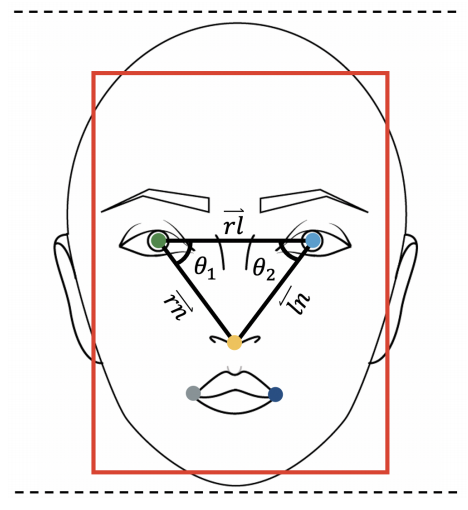
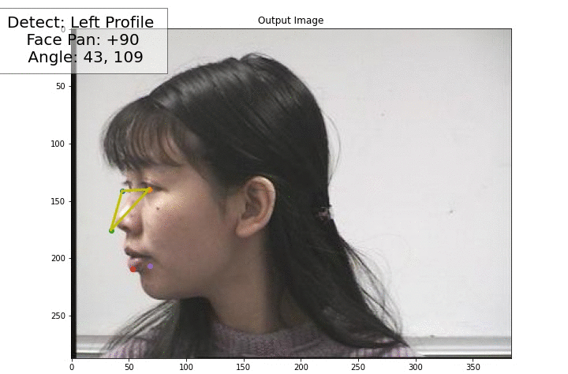

- [Installation](#installation)
  - [Natively](#natively)
  - [Docker](#docker)
- [Face Pose Detection](#face-pose-detection)
  - [How to use](#howtouse)


# Installation
## Natively
```pip install -r requirements.txt```

## Docker
```docker soon :(( ```

# How to use
You can see the example [notebook](Notebooks/FacePoseDetection.ipynb). Also you can install all the requirements and run this command

```python DetectFacePose.py -p <image_path> ```

or 

```python DetectFacePose.py -u <image_URL> ```

# Face Pose Detection 
This repo will look into a technique that might help detect face orientation or pose. And I will focus on only detecting three main poses which are:
- Frontal Face.
- Right Profile.
- Left Profile.

Detecting tilted face either front or back is out of the scope of this post. The technique detects only out-of-plane orientation estimation which is face rotation with respect to the y-axis (pan rotation). Since the technique relies heavily on the face detection model, I used MTCNN because it produces facial landmarks that we will use to detect face poses. Simply explained when a face is detected for the first time, we extract face landmarks (i.e., right eye, left eye, nose, left mouth, and right mouth) and from these points, we calculate the angels between the right eye, left eye, and the nose using a Cartesian coordinate system for Euclidean space 2D. Setting threshold ranges -which we already experimented with- for the right eye angle and left eye angle can estimate if the face left, or right profile, or frontal face.

Facial Landmarks and Illustration for eyes anglesAs shown in the figure we are going to calculate the angles $\theta_1$ and $\theta_2$. 
After the model produces the landmarks we draw an "imaginary" line between three points i.e., right eye, left eye, and the nose. Forming a triangle and through that triangle, we calculate the angle $\theta_1$ and $\theta_2$. This step, geometric object that possesses both a magnitude and a direction. A vector can be pictured as an arrow or a line. Its magnitude is its length, and its direction is the direction that the line points to. For more details, I would recommend to see  [Manivannan](https://manivannan-ai.medium.com/find-the-angle-between-three-points-from-2d-using-python-348c513e2cd) post about how to calculate angles with python, also thanks to him since his post helped me a lot. Next figure demonstrate how to calculate angles:


And here an example from 
[Head Pose Image Database](http://crowley-coutaz.fr/Head%20Pose%20Image%20Database.html):



For more details see the full document [Here](Documents/FacePoseDetection.pdf). 